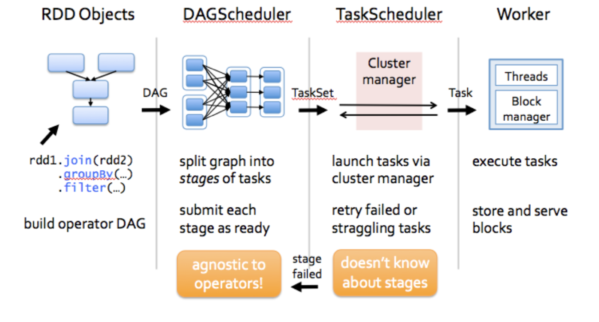

# ScalableML


### 1. Lab1 and Background Notes

#### 1.1 The Configuratiion problems and Fixes

> **Mac - Switch the Different JAVA version on Mac** 
>
> 1.Firstly, you should specify your JAVA installed version in your mac, you could input this command into your computer.
>
> ```shell
> $ /usr/libexec/java_home -V
> Matching Java Virtual Machines (2):
>     13, x86_64:	"Java SE 13"	/Library/Java/JavaVirtualMachines/jdk-13.jdk/Contents/Home
>     1.8.0_241, x86_64:	"Java SE 8"	/Library/Java/JavaVirtualMachines/jdk1.8.0_241.jdk/Contents/Home
> ```
>
> 2.Next, visit the orcle website to install the JDK software NOT JRE in your mac, the default installation position is `/Library/JAVA/JavaVirtualMachines`, you could obtain all the effective JDK components from [there](https://www.oracle.com/java/technologies/javase/javase-jdk8-downloads.html).
>
> 3.Next, we should update the `~/.bash_profile` to add the command into the default environment.
>
> ```shell
> $ vi ~/.bash_profile
> # Add below lines into the end of this file
> export JAVA_8_HOME="$(/usr/libexec/java_home -v 1.8)"
> export JAVA_13_HOME="$(/usr/libexec/java_home -v 13)"
> 
> alias jdk8="export JAVA_HOME=$JAVA_8_HOME"
> alias jdk13="export JAVA_HOME=$JAVA_13_HOME"
> # indicate the default jdk version
> export JAVA_HOME=$JAVA_8_HOME
> ```
>
> 4.Update the `~/.bash_profile` and switch your JAVA version.
>
> ```shell
> $ source ~/.bash_profile
> $ jdk8 && java -version
> java version "1.8.0_241"
> Java(TM) SE Runtime Environment (build 1.8.0_241-b07)
> Java HotSpot(TM) 64-Bit Server VM (build 25.241-b07, mixed mode)
> $ jdk13 && java -version
> java version "13" 2019-09-17
> Java(TM) SE Runtime Environment (build 13+33)
> Java HotSpot(TM) 64-Bit Server VM (build 13+33, mixed mode, sharing)
> ```


> **Install the `Spark(2.3.2)` and Configure the Jupyter Notebook on local Machine(MAC)**
>
> 1.Go to this [Link](https://archive.apache.org/dist/spark/) to download all the history Apache Spark software. Select one specific version you want.
>
> 2.Extract the downloaded file into the location `/usr/local`, if you don't know how to access to this  path directly you can open the `finder` and press `Shift+Command+G`, open the `~/.bash_profile` to add the Spark documents into the system path.
>
> ```shell
> $ vim ~/.bash_profile
> # Change the command to accord with your situation
> export SPARK_HOME=/usr/local/{spark-2.3.2-bin-hadoop2.6}
> export PATH="$PATH:$SPARK_HOME/bin:$PATH"
> ```
>
> 3.Check the python version from your computer and You should add the the correspnding location information into the `~/.bash_profile` 
>
> ```shell
> $ which python3
> {Your Default Python Installation Location}
> $ vim ~/.bash_profile
> export PYSPARK_PYTHON="{Your Default Python Installation}"
> # e.g. "/Library/Frameworks/Python.framework/Versions/3.5/bin/python3.5"
> export PYSPARK_DRIVER_PYTHON="{Your Default iPython Installation}"
> # e.g. "/Library/Frameworks/Python.framework/Versions/3.5/bin/ipython3"
> export PYSPARK_DRIVER_PYTHON_OPTS="notebook"
> alias pysbook='$SPARK_PATH/bin/pyspark'
> ```
>
> 4.After that, you could open the `Jupyter Notebook` by `pyspark` command or `pysbook`. You can alter the kernel as you like.
>
> 5.Enjoy your `Pyspark`!


> **Disscussion on the Command `qrshx` on the HPC**
>
> 1.The details of the `qrshx`:
>
> ```shell
> $ qrshx -P {Parameters} 
> #gpu: GPU-equipped nodes (public)
> #rse: Research Software Engineering group's CPU-only nodes (restricted access)
> #rse-training: For training courses run by the Research Software Engineering group (restricted access)
> #insigneo-imsb: Insigneo Integrative Musculo-Skeletal Biomechanics (IMSB) subgroup's nodes (restricted access)
> #security: Computer Science Security project (restricted access)
> #cstest: CiCS testing only
> 				-pe openmp 4
> #The numebr of cores
> #The amount of cores should be below the 4
> 				-l rmem=16G
> #obtain the real memory
> 				-M {Your email address}
> 				-j y
> #allow you to disconnect the HPC
> 				-gpu=1
> #the GPU numbers you want to use
> #https://docs.hpc.shef.ac.uk/en/latest/sharc/GPUComputingShARC.html#gpucomputing-sharc
> $./{my_programe} --num-cores=2
> ```
>
> 2.The command should accod with the [JupyterHub Server](https://jupyter-sharc.shef.ac.uk/) interface information. If not, you will not be allowed to distribute the resource.


> **The Command `spark-submit`**
>
> The `spark-submit` script in Spark’s `bin` directory is used to launch applications on a cluster.
>
> For Python, you can use the `--py-files` argument of `spark-submit` to add `.py`, `.zip` or `.egg` files to be distributed with your application.
>
> For General use, we could rely on this command to submit the jobs to the could clusters by requesting the resources.
>
> Essential Parameters:
>
> +  **--master MASTER_URL**: The [master URL](https://spark.apache.org/docs/latest/submitting-applications.html#master-urls) for the cluster.
>
>   There are two different modes
>
>   + Spark On Mesos : mesos://host:port
>   + Spark On YARN: yarn://host:port
>   + local
>
> + **--class**: The entry point for your application (e.g. `org.apache.spark.examples.SparkPi`)
>
>   Only used for JAVA and Scala Application.
>
> + **--py-files**: The equivalent `--py-files` option can be used to distribute `.egg`, `.zip` and `.py` libraries to executors.


> 

#### 1.2 Background Information

##### **Recap**:


The Spark application can be interpretered into two parts: Driver Program and Application Master with the high level consisting of the **SparkContext** , Creating the RDDS and Performing the remain processes to achieve the final result.These transformations of RDDs are then translated into DAG and submitted to Scheduler to be executed on set of worker nodes.

The Spark application can handle with the user program request and separate process to excute user application, it can also creates SparkContext to control the cluster manager and schedule job execution.




##### **RDDs(Resilient Distributed Dataset)**:

<u>RDD</u> could be regarded as the immutable parallel data structure with failure recovery possibilities. The Spark provides the APIs for materializations of data as well as for control over caching and partitioning of elements to optimize data placement. RDD stores information about its parents to optimize execution (via pipelining of operations) and recompute partition in case of failure. Each RDD is split into multiple partitions (similar pattern with smaller sets).
which may be computed on different nodes of the cluster.

RDD has five main properties in Pyspark:

```python
//a list of partitions (e.g. splits in Hadoop)
def getPartitions: Array[Partition]

//a list of dependencies on other RDDs
def getDependencies: Seq[Dependency[_]]

//a function for computing each split
def compute(split: Partition, context: TaskContext): Iterator[T]

//(optional) a list of preferred locations to compute each split on
def getPreferredLocations(split: Partition): Seq[String] = Nil

//(optional) a partitioner for key-value RDDs
partitioner: Option[Partitioner] = None  
```

Next, we will talk about the details and demenstration of functions in initialing pyspark RDD.

```python
# Two main ways to create RDDs:
# 		+ load an external dataset(SQL/Hadoops)
# 		+ distributing a set of objects

from pyspark.sql import SparkSession
spark = SparkSession \
			.builder \
  		.appName("Demo RDD Example") \
    	.config("spark.some.config.option","some-value") \
      .master("local") \
      .getorCreate()
      
df = spark.sparkContext.parallelize([(1,2,3,'a b c')]).toDF(['col1','col2','col3','col4'])

# output
+----+----+----+-----+
|col1|col2|col3| col4|
+----+----+----+-----+
|   1|   2|   3|a b c|
+----+----+----+-----+

```

The `SparkSession` is the entry point and can be created DataFrame as the input data frame. 

The `.builder` allows users to construct a new SparkSession instance. 

The `.config` could allow system to select a config about the application users created which can use this method are automatically propagated to both `SparkConf` and [`SparkSession`](https://spark.apache.org/docs/latest/api/python/pyspark.sql.html?highlight=sparksession#pyspark.sql.SparkSession)’s own configuration. In other words, it is the the configuration of the Spark application, used to set various Spark parameters as key-value pairs.

```python
from pyspark import SparkConf
new_instance = SparkConf()
spark = SparkSession.builder.config(new_instance)
```

The `.master` sets the Spark master URL to connect to, such as “local” to run locally, “local[4]” to run locally with 4 cores, or `'spark://master:7077'` to run on a Spark standalone cluster.


