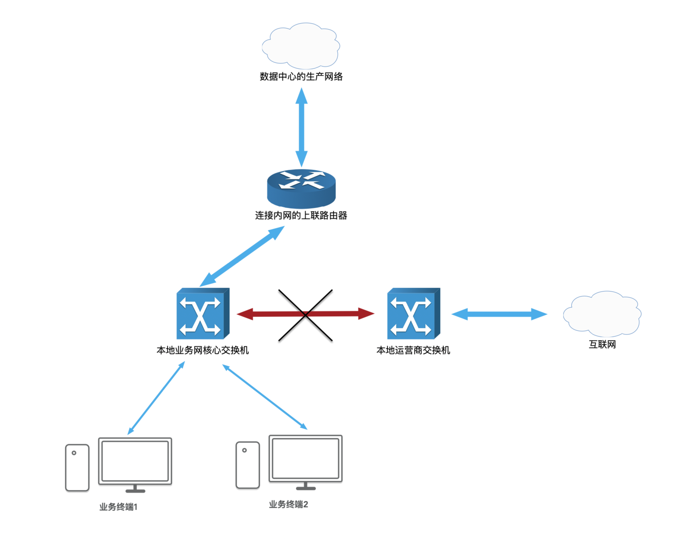
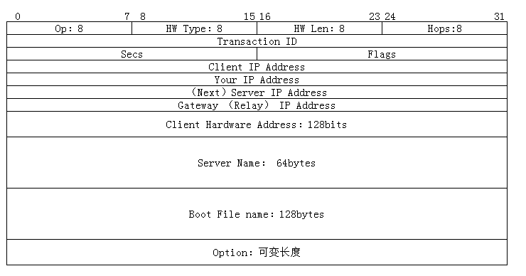
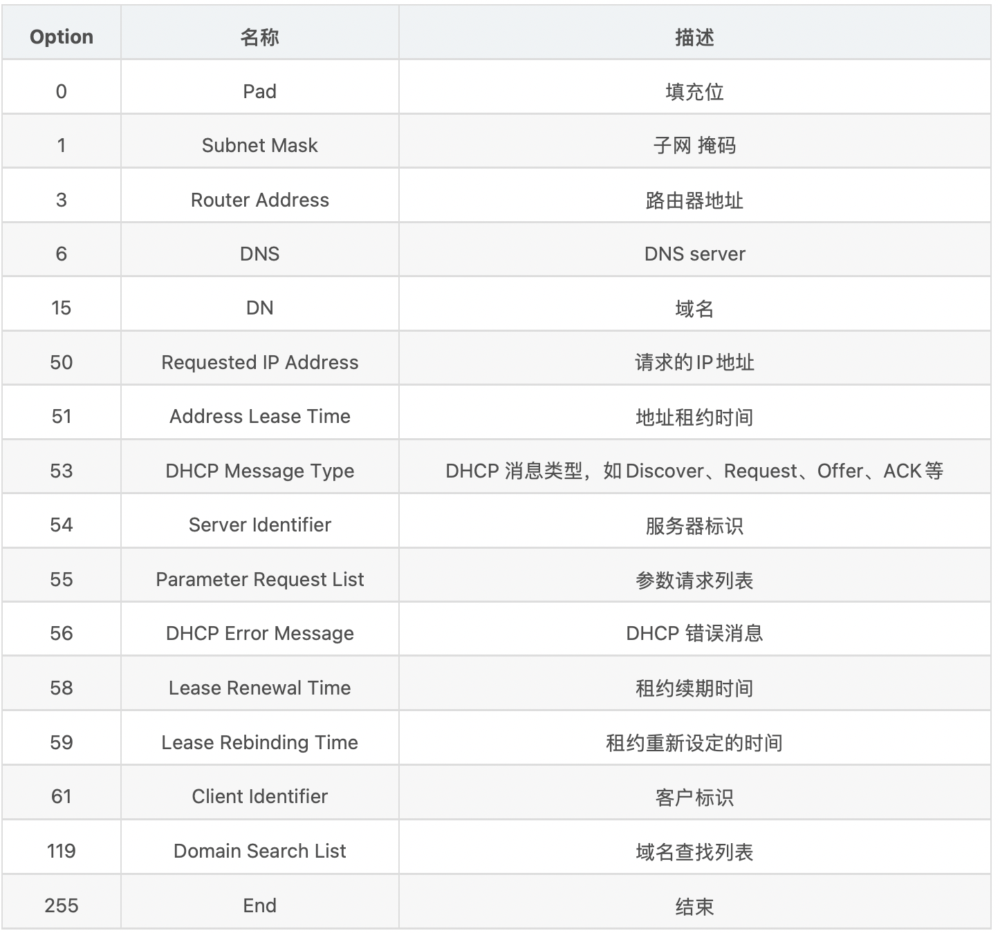
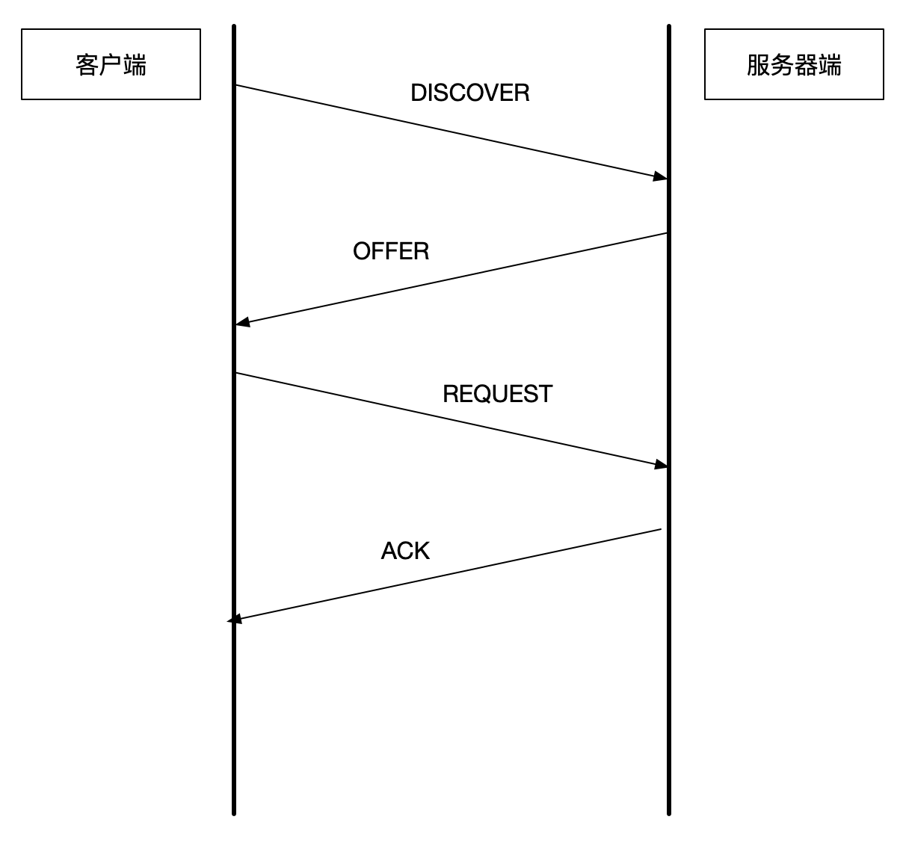

# DHCP (Dynamic Host Configuration Protocol )协议的探讨与分析

## 问题背景

最近在工作中遇到了连接外网的交换机在`IPv6`地址条件下从运营商自动获取的`DNS`地址与本机手动输入配置的`IPv4`地址下的`DNS`发生冲突的问题，这个问题在实际的生产网上会带来业务的中断和不稳定，在进入到生产环境中的本地终端发送给数据中心的网络流量会因为`IPv4` 和 `IPv6` 下的`DNS`冲突而导致无法正确的发送流量。

在终端中，默认的`IPv6` 的优先级会大于`IPv4`的优先级，这样就会带来网络地址冲突问题，解决的问题就是将连接外网的网络线从与连接内网的交换机中断开即可以解决。下边的图片说明了该问题的发生的场景:

从上边的图看出，业务终端连接着“本地业务网核心交换机”来获取和转发网络流量到数据中心生产网络中的服务器，在正常的条件下，“本地业务网核心交换机”和“本地运营商交换机”是**不能**通过网络跳线连接在一起并配置到同一个`Vlan`中的。在本次问题中，因为“本地运营商交换机”和“本地业务网核心交换机”连接在了同一个`Vlan`，导致了业务终端的业务流量从数据中心生产网络来源的不稳定，而造成了业务不稳定。

在这个解决问题的过程中，有`DHCP`和`ARP`在实际网络环境下的运用场景和背景模糊不清的问题，故而撰写这篇博客来复习和巩固`DHCP`协议。

## DHCP 概念

### 1. 什么是 DHCP 网络协议

网络是非常复杂且抽象的，网络中的硬件设备比如 路由器、交换机、集线器、网线、网卡、网桥共同组成了核心网络，在硬件设备上流通的网络流量，做到怎么去引导网络流量正确得流向到正确的网络设备上，需要`TCP/IP` 协议作为网络流量的核心协议。

但是如果一个网络管理员想要正确地让`TCP/IP`协议正确运行，需要给网络中的主机和路由器配置一些关键信息，比如说接口的`IP`地址。我们可以轻易地在电脑上输入 `ipconfig` 命令去显示当前网络设备的网络地址信息，那么这个地址到底是怎么被分配到当前的设备上的？

对于一个网络设备(终端)的核心`IP`信息主要有: 	`IP地址`、`子网掩码` 和 `DNS服务器地址`。

而获取网络设备的 `TCP/IP`信息主要有这几个方面：

+ 手动配置 - 通过终端上的配置界面根据业务的要求进行手动配置。
+ 动态获取 - 例如 `windows` 上的手动配置选项上的动态获取选项。
+ 特定的算法进行计算。

一般来说，对于服务器端的采用`手动配置方式`来适应业务的核心需求，对于客户端比如连接网络拓扑上的个人终端那么采用`动态获取方式`来获取相关信息。

原因有以下几个方面:

+ 客户端与服务器端的交互会更加频繁，并且客户端可能会在网络中发生迁移。
+ 服务器端的配置服务要求客户端的网络一定必须是固定的。

在这个场景下，客户端需要从服务器端**动态地**获取服务器端的信息并配置到本地中，这个时候 `DHCP`就派上了用场。在本文中，主机 == 客户端，即任何需要从网络中获取地址的设备( 不包括 网络中的路由器)，请区别开这个方面的概念。服务器 = 服务端，有时候并不一定是一个独立的设备，而是一个应用程序(在大多数条件下)，希望能将这些方面的概念区别出来。

**DHCP**，从英文的含义来说，Dynamic Host Configuration Protocol，是用来动态地配置主机的相关状态，从`DHCP`的发展来说，`DHCP`是继承于`BOOTP` 协议 ( Bootstrap Protocol )，后者在设计协议的过程中仅仅提供了有限的主机信息配置，并且主机的信息一旦从远程服务器端分配之后，就很难再被修改；`DHCP`的出现改变了这种局面，`DHCP`几乎提供了所有的主机配追信息，并且引入了`租约`的概念，使得主机信息能够动态地产生变化和进行更改。此外，作为可以动态地更改主机的配置的协议，

`DHCP` 是一个基于 `Client/Server` 模式的网络协议。

`DHCP` 是基于`UDP/IP`协议进行传输，服务器端使用端口 `67`, `DHCP`客户端使用端口号 `68`。

### 2. DHCP 协议内容

`DHCP`主要分为两个部分:     `网络IP地址的管理` 和  `配置信息的传递`

+ 网络IP地址的管理：  地址管理处理 `IP` 地址的动态分配， 并且为每一个主机 (Host) 提供地址的租约
+ 配置信息传递:  从服务器端向主机端传递报文 和 状态机的配置。

### 3.DHCP 地址管理

**地址池** 与 **地址租约** 

如果用户在客户端中申请配置一个 `动态网络地址配置`，那么 `DHCP客户端(Host) `会向 DHCP服务器 发送一个 IP地址请求。 这个时候在远程的 `DHCP服务器` 就会维护一个 `IP地址池`，并且从这个地址池来取出一个`IP`回应给 DHCP客户端。 在地址分配的过程中，`DHCP服务器`也会指定回应给 `DHCP客户端`的IP地址的租约期，在租约期中，这个地址可以被客户端使用，租约期到之后这个IP地址被 DHCP服务器自动收回。客户端可以在租约期内请求延长租约。

**DHCP 报文内容**

DHCP的组成从网上有很多解释，下图来自网络:

+ **Op：** 报文类型，分为 两大类： `Request（1）` 和 `Reply（2）`
+ **HW Type：** 硬件类型，一般是以太网：1
+ **HW Len：** 硬件地址长度，单位字节。对应以太网：6（mac地址长度为6字节48bit）
+ **Transaction ID：**事务ID，随机数，有客户端生成，服务器Reply时，会把 Request 中创建的 Transaction 拷贝到Reply报文中。用于客户端区分网络上的目的地为自己的报文。
+ **Secs：** 距离第一次发射IP请求或Renew请求过去的秒数
+ **Flags：**标志位，目前仅第一个bit有使用，置1 标明广播
+ **Client IP Address：**当前客户端的IP地址，如果当前客户端没有IP地址，则置0
+ **Your IP Address：** 服务器想客户端提供IP地址时，会把IP地址填入本字段
+ **（Next）Server IP Address：**客户端引导时需要的另一个服务器的IP地址
+ **Gateway （Relay） IP Address：** 网关（中继）IP地址，有DHCP 中继器在转发DHCP报文的时候填入
+ **Server Name：** Server名字，有64bytes，一般不使用，填充为0
+ **Boot File name：** boot file的路径，128bytes， 一般不使用，填充为0
+ **Option：** 选项，不定长度。 DHCP报文中比较重要的字段

**DHCP Option 内容**

之前介绍过，因为`DHCP`是从`Bootp` 协议继承和拓展过来的，因此很多不能在`Bootp`实现的内容都放到了`Option` 来实现。通俗来说，`DHCP`协议其实就是携带许多`Option`的`Bootp`。

报文中的`Option`遵循以下的形式:

+ 如果Option没有值，则只有标志位之类的内容，则以一个字节表示
+ 如果Opiton有值，即Opiton是以下name-value对，则Opiton需要多个字节表示，其中第一个字节表示 option的名字，第二字节表示value的长度，第三个字节开始表示value。

常见的`Option`类型情参照下图:

### 4.DHCP 工作原理

#### 主机加入到一个新的网络中

DHCP 将一台从未分配过的主机加入到网络需要经历四个阶段: 1. 发现阶段，2.提供阶段，3.请求阶段，4.确认阶段。

**发现阶段**

新的`Client`加入网络时，会使用`0.0.0.0`作为源地址，发送`discover广播报文`，查询网络上有哪些`DHCP Server`，以及这些`DHCP Server` 能`Offer`哪些`IP地址`。这个广播帧的`MAC地址`为新的`Client`的`MAC地址`，类型字段为 `0x0800`，载荷数据为一个广播 IP 报文，该报文的`目的IP地址` 为有限的广播地址: `255.255.255.255`， 协议字段值为 `0x11`, 载荷数据是一个 UDP报文，消息为 `DHCPDISCOVER`。

在该阶段中，与客户端所在二层网络中的所有网络设备都会接收到这个广播帧，并将这个广播帧洪泛出去，在其他设备接收到这个数据帧的时候会将相关的载荷按照网络分层的结构逐层上传。在设备的传输层 `UDP模块` 在接收网络层上传的数据包之后会解析数据包的端口号。 对于一个DHCP服务器来说，67 作为独特的端口号，会被打开，而对于其他的设备来说这个端口不被打开，那么这个数据包就被丢弃。

在华为的数通教材HCNA中，给出的例子是路由器上运行了 `DHCP`服务器 ， 但是链路中可能有多个设备也运行了`DHCP`服务器，这个时候所有**收到该请求包的DHCP服务器**都会给请求客户端回复一个响应数据包来证明自己已经接收到了请求信息，返回的数据包都会被发送到请求的客户端。

对于DHCP的传输模式 - UDP协议，是一种面向无连接的、不需要可靠传输的通信方式，因此 DHCP 需要依赖自己的一种可靠的传输传输方式，其中包括：**什么情况下需要重复发送已经发送过的请求（重传消息机制）**，**重复请求的间隔时间是多少**，**最大重复次数是多少**等等...

**提供阶段**

`DHCP Server`接收到`DHCP Discover`报文后，回应`Offer`报文，提供`IP地址`（可能包含DNS等其他信息）给`Client`。

这个阶段中，不涉及客户端是否接受服务端给出的 IP 地址，只是服务器端给客户端的一个响应。 每个接收到 `DHCPDISCOVER` 消息的服务器，都从自己维护的 IP 地址池分配出一个有效的且未被使用的 IP地址，并通过 `DHCPOFFER` 消息将这个IP地址分配发送给客户端。

对于一个 `DHCPOFFER` 消息来讲，消息被封装在客户端预留端口号为`68`，源端口号`67`的一个UDP报文中，该UDP报文又是被上层封装到一个被广播的IP报文中。 这个IP报文的目的地址是一个有限广播地址：`255.255.255.255`，源地址为DHCP服务器端所对应的单播地址，其中协议字段为`0x11`，该IP报文又被上层封装到了一个广播帧中，这个广播帧的源MAC地址为 DHCP Server 所对应的**单播MAC地址**，类型字段的值为 `0x0800`。

在传输的过程中，与请求客户端所在同一个二层网络中的所有设备都会接收到这个请求数据包，只有开启了 `DHCP Client` 服务的客户端才会接收到这个数据包的载荷数据（DHCPOFFER），并上传至应用层上的 `DHCP Client` 中。

但是在同一个二层网络中可能存在着其他同样打开 `DHCP Client` 服务的客户端，一个请求客户端在接收到从 `DHCP Server` 返回的报文`DHCPOFFER`如何区分在收到的返回报文是不是自己发出的请求呢？

+ 其实请求客户端发送 `DHCPDISCOVER` 请求的时候就已经创建了一个用于区别请求和返回且独一无二的**交易号**(`Transaction ID`) ，这个交易号会在**服务端向客户端**发送`DHCPOFFER`回执的时候会将这个交易号一起发送回去，在请求客户端接收到`DHCPOFFER`时会判断响应的报文中的交易号是否与之前创建的交易好相同。
+ 创建的交易号为一个 4字节 （32bit） 二进制数。

**请求阶段**

在请求阶段中，发送请求的客户端可能会接收到多个 `DHCPOFFER`报文，这个时候请求客户端会自己选择一个`DHCP Server`，并广播一个 `DHCPREQUEST` 的请求包给选择的 `DHCP Server`。并向本地中其他的 `DHCP Server` 公告自己已经选择了某个 `DHCP Server`的某个IP地址，这个时候其他的未被选择的 `DHCP Server` 接收到了`DHCPREQUEST` 报文明白该请求客户端已经选择好了`DHCP Server`，那么这些服务器就会收回当初分配给请求客户端的 `DHCPOFFER` 以及 预留的IP地址。

请求客户端该过程发送的广播帧的源MAC地址为该请求客户端的MAC地址，类型字段的值为`0x0800`，载荷数据是一个**广播IP报文**。该IP报文的目的地址是广播地址（`255.255.255.255`），源地址是 `0.0.0.0`，协议字段的值为 `0x11`，载荷数据是一个**UDP报文**。该UDP报文的目的端口号为`67`，源端口号为`68`，载荷数据是一个 `DHCPREQUEST`。

`DHCPREQUEST`上携带者有请求客户端已经选定的 `DHCP Server` 的标识号 (Identifier)，表示这个请求客户端只接受已经选定的`DHCP Server` 的 OFFER。

**确认阶段**

在该阶段中，`DHCP Server` 会向请求客户端（DHCP Client）回复 `DHCPACK` 消息用来表示自己已经接收到了请求客户端的请求。

`DHCPACK` 消息的类型是一广播IP报文，IP报文的目的IP地址是一个有限的广播地址 `255.255.255.255`，其源地址为请求客户端对应的单播IP地址。其载荷数据是一个UDP报文，UDP报文的源端口号是67，目的端口号是68。

在这个过程中有一个特殊情况，就是在请求客户端和分配IP地址的`DHCP Server`通讯的过程中预先分配给请求客户端的IP地址分配给了其他的主机应该怎么办？

+ 请求客户端接收到了 `DHCPACK` 报文之后，会立即借助 `Gratutious ARP` 消息机制来检查自己的IP地址是不是唯一的。
+ 如果这个地址已经被其他的客户端占用，那么该请求客户端就会主动放弃该IP地址，并向 DHCP Server发送 `DHCPDECLINE` 告诉该地址已经被其他客户端占用，然后经过一段时间之后重新尝试获取改地址。
+ 如果这个地址一直无法被分配，那么请求客户端就会发送一个`DHCPRELEASE` 报文给 `DHCP Server`声明放弃这个地址，然后重新从谈发现阶段开始。

#### 主机已经有IP地址，只想更新租约

1.此时可以跳过`DHCP Discover报文`和`DHCP Offer报文`。

2.`Client`发送携带当前`IP地址`的`Request报文`。

3.如果`Server`同意`Client`续约，则发送`DHCP ACK报文`。如果拒绝续约，则发送`DHCPNAK报文`。

下边有一个图来具体的说明 `DHCP` 的工作原理以及建立相关网络联系的流程和原理:

### 5.DHCP在华为模拟器上的实验

