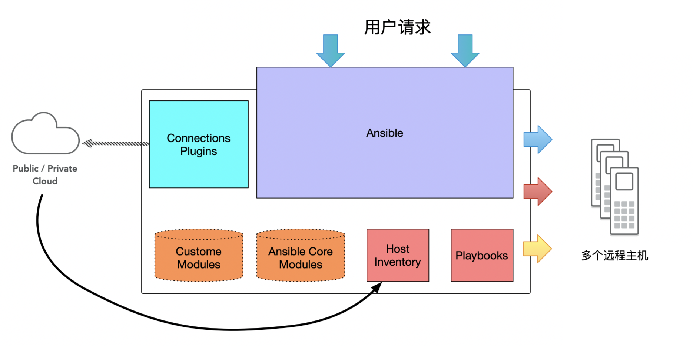

---

**目录**

[TOC]

---

# Ansible - 配置你的自动化运维工具/平台教程


## 1. 你好 Ansible

`Ansible` 作为一款基于`Python`的解释性语言，用于部署到集群化的远程设备中，但是这些远程设备必须是允许`SSH`连接的任何主机，包括远程虚拟机和物理机。Ansible 的这一点，区别于传统配置网络设备和进行大规模对网络拓扑设备的操作，SSH的连接方式可以让连接网络设备的管理变得更加便捷和安全。其次，Ansible支持大规模、自动化地实现系统配置、应用部署、命令以及服务操作的特性，让运维人员的工作效率得以显著的提升。

目前，我读了一下网上可以找到的Ansible的教程，我觉得他们写的都不是非常的清楚和直观，去看了官方的文档看得我云里雾里，因此想写一篇博客来总结一下在学习过程中的问题。Ansible 的学习并不像学习一门新的编程语言那么需要具体的项目代码经验，而是更偏向于一种实际应用中的配置，希望这篇博客能为你了解 Ansible 提供帮助。

参考资料:

> **Ansible官方文档**	https://docs.ansible.com/
>
> **Ansible快速入门**	https://www.ansible.com/resources/get-started
>
> 
>
> 

下一个我想学习的方向是最近系统虚拟化最流行的平台，DOCKER，接下来想要用Docker构建自己的第一台靶机，先放上我的图片！接下来，让我们了解一下Ansible的安装方法以及Ansible的对应架构。


### 1.1 安装Ansible

> 我的操作环境：
>
> Server环境：	Mac OS Big Sur - 11.0.1 (11.1.0)
>
> Agent环境:	 Linux version 5.8.15-301.fc33.x86_64 (mockbuild@bkernel01.iad2.fedoraproject.org) (gcc (GCC) 10.2.1 20200826 (Red Hat 10.2.1-3), GNU ld version 2.35-10.fc33)

**(为了避免操作命令混淆，操作命令前有`MACOSX` 标识的代表在主机上进行操作，操作命令前有`Fedora`代表在虚机上进行操作)**

**为什么选择Fedora作为虚机？**

—— Fedora 的定位是 Red Hat 的测试版系统，而 Ansible 已经被 Red Hat 所收购，因此 Red Hat 对于 Ansible的支持会相较于其他的主流操作系统(OSX Windows)更加友好和便捷。此外，相比较其他Red Hat的操作系统来说，该版本可以让你更快速、直接地进行安装部署，省去了 Red Hat 其他系统配置的麻烦，并且 Fedora 的默认源中包括了 Ansible，直接安装即可。

下载 Fedora 地址:	https://getfedora.org/en/workstation/download/

安装 Fedora 到 Mac Vmware 虚拟机并不需要额外的操作配置流程，请按照Vmware Fusion默认的流程即可。

**安装 Ansible 到你的Mac主机上**

在安装到主机之前，我居然突发奇想升级到了最新的 Big Sur 系统 (11.1)，我想说这个系统目前有很多令人烦恼的Bug，比如说在参照官网的安装说明进行安装 -  `pip`  包管理器安装的 `Ansible`，安装结束后 `Ansible` Command 无法在 `ITerm` 中找到，此外 `Iterm` 会出现环境变量混乱的问题，连一个基础的 `vim` 命令都无法正常执行，所以升级系统环境前一定要谨慎！

参考解决的地址:	https://stackoverflow.com/questions/63177609/zsh-command-not-found-ansible-after-pip-installing/65166458#65166458?newreg=5429c14d34b94738a869ff554e8c115a

如果你想要安装到最新的Big Sur 系统中，请按照下边的命令进行操作:

1.安装 Ansible 到Mac上

```shell
MACOSX$ sudo pip3 install ansible
```

2.查看`Ansible`是否成功地被安装到了服务端上

```shell
MACOSX$ ansible --version
ansible 2.10.4
  config file = None
  configured module search path = ['/Users/doheras/.ansible/plugins/modules', '/usr/share/ansible/plugins/modules']
  ansible python module location = /usr/local/lib/python3.7/site-packages/ansible
  executable location = /usr/local/bin/ansible
  python version = 3.7.7 (default, Mar 10 2020, 15:43:33) [Clang 11.0.0 (clang-1100.0.33.17)]
```

**安装 Ansible 到 Fedora 虚拟机上（非必需）**

1.通过 `yum` 命令安装`Ansible`:

```shell
MACOSX$ sudo yum install epel-release
```

```shell
MACOSX$ sudo yum install ansble -y
```

```shell
MACOSX$ ansible --version
ansible 2.9.15
  config file = /etc/ansible/ansible.cfg
  configured module search path = ['/home/doheras/.ansible/plugins/modules', '/usr/share/ansible/plugins/modules']
  ansible python module location = /usr/lib/python3.9/site-packages/ansible
  executable location = /usr/bin/ansible
  python version = 3.9.0 (default, Oct  6 2020, 00:00:00) [GCC 10.2.1 20200826 (Red Hat 10.2.1-3)]
```

**Ansible 的架构**

现在简单介绍一下 Ansible 的架构。



+ **Ansible Core Modules**: 为 Ansible 自带的核心模块。
+ **Custom Modules**: 如果核心模块不足以完成某种功能，可以自行添加自定义模块(支持现在主流的大部分编程语言，甚至于shell)
+ **Plugins**: 插件，支持使用插件的方式对ansible本身的功能进行扩展，模块是用来实现任务的，增强Ansible平台自己的功能就需要使用插件 (loggin插件记录日志，email插件发送邮件)，其中最常用的是：连接插件(Connectionr Plugins) Ansible基于连接插件连接到各个主机上，虽然默认情况下ansible使用ssh连接到各个主机上，但它还支持其它的连接方法。
+ **Host Inventory**: 主机群，主机清单，用来定义被Ansible管理的客户端，包括存放针对不同主机配置的配置信息，包括 IP地址 、 主机密码 、 连接方式等等。
+ **PlayBooks**: Ansible的任务配置文件，管理员将多个任务定义到该文件中，最后由Ansible自动执行。

**Ansible 的工作原理**：

+ Ansible 将所有的指令自动转换成为 shell 命令，通过 `Openssh` 连接到目标主机，将所需要的指令的目录下（`/root/.ansible/tmp`），最后自动执行，执行完成后删除 `tmp` 文件。

### 1.2 配置Ansible实验拓扑(主机/虚机)

对Ansible的操作学习需要搭建客户端与服务端，其中客户端是你需植入自动化脚本的目标--你的目标机，服务端需要安装Ansible来对客户端进行控制--你的主机。我构建的实验拓扑图如下:


---

在 Mac OS Big Sur 上成功安装 Ansible 之后，会出现很多问题，下边列举了我遇到的问题及其解决办法。

**1.在`Ansible`成功安装到Mac之后，无法在默认配置路径找到`hosts`文件。**

非常奇怪的问题，可能是因为`pip3`安装管理工具的问题，我参照了许多解决办法以下的解决办法比较有效。这时候在客户端上安装的Ansible就起了很大的作用了，在 Fedora 虚拟机中找到对应的目录，并拷贝目录下的文件到主机 Mac 上。

> **第一种解决办法：直接在默认的配置目录下（/etc/ansible）创建一个新的hosts文件**
>
> 请参照以下的内容填充你的hosts文件，创建新的文件命令为: `vim /etc/ansible/hosts`
>
> ```shell
> # This is the default ansible 'hosts' file.
> #
> # It should live in /etc/ansible/hosts
> #
> #   - Comments begin with the '#' character
> #   - Blank lines are ignored
> #   - Groups of hosts are delimited by [header] elements
> #   - You can enter hostnames or ip addresses
> #   - A hostname/ip can be a member of multiple groups
> 
> # Ex 1: Ungrouped hosts, specify before any group headers.
> 
> ## green.example.com
> ## blue.example.com
> ## 192.168.100.1
> ## 192.168.100.10
> 
> # Ex 2: A collection of hosts belonging to the 'webservers' group
> ## [webservers]
> ## alpha.example.org
> ## beta.example.org
> ## 192.168.1.100
> ## 192.168.1.110
> Test ansible_ssh_port=22 ansible_ssh_user=doheras ansible_ssh_server=172.16.2.8 ansible_ssh_pass=123 
> 
> # If you have multiple hosts following a pattern you can specify
> # them like this:
> 
> ## www[001:006].example.com
> ```
>
> 配置完成之后可以运行命令查看当前已经配置的主机
>
> ```shell
> MACOSX$	ansible all --list-hosts
> ```
> 
>

> **第二种解决办法: 修改对应的 Host Inventory 并添加新的 Hosts**
>
> 参考链接:	https://matthieu.bordonne.fr/wordpress/?p=146
>
> 系统默认的 Host Inventory 文件的目录为 `/etc/ansible/hosts`，但是如果你想要为你的每一个项目添加一个独立的 Inventory 文件，那么你就需要花费一点功夫了。有三种可行的方法自由地定制你每次操控的 Inventory 文件：
>
> + 在每一条命令后边后缀上下列命令
>
>   ```shell
>   $ -i <inventory_file>
>   ```
>
> + 找到`ansible.cfg` 并修改你的 Inventory_file 的路径。该文件的路径为: `/etc/ansible/ansible.cfg`
>
> + 设置你的环境变量改为:   `ANSIBLE_INCENTORY=/path/to/inventory_file`
>
>   

**2.在`Ansible`配置完成之后连接客户端时出现错误**

```shell
(base) MacBook-Pro:~ doheras$ ansible all -a "id"
172.16.2.8 | FAILED | rc=-1 >>
to use the 'ssh' connection type with passwords, you must install the sshpass program
```

在`Mac OS`环境下运行Ansible命令时提示需要安装`sshpass`来保证SSH连接不需要密码。在配置了ssh免密认证id_rsa.pub之后，在cmd终端可以实现免密登陆对应配置了密钥的服务器，但是在python程序中，想要调用cmd执行免密操作，还需要安装sshpass，sshpass用于非交互式的ssh密码验证。

安装的方法可以借助 Max OS 下最有名的包管理器，命令如下:

```shell
MACOSX$ brew install hudochenkov/sshpass/sshpass
```

在安装的时候有可能你会遇到以下的错误:

```shell
Error: Your Command Line Tools are too outdated.
Update them from Software Update in System Preferences or run:
  softwareupdate --all --install --force

If that doesn't show you an update run:
  sudo rm -rf /Library/Developer/CommandLineTools
  sudo xcode-select --install

Alternatively, manually download them from:
  https://developer.apple.com/download/more/.

Error: Your CLT does not support macOS 11.
It is either outdated or was modified.
Please update your CLT or delete it if no updates are available.
Update them from Software Update in System Preferences or run:
  softwareupdate --all --install --force

If that doesn't show you an update run:
  sudo rm -rf /Library/Developer/CommandLineTools
  sudo xcode-select --install
```

请按照错误给出的解决办法进行处理:

```shell
MACOSX$  softwareupdate --all --install --force
```

如果上边的命令无法解决，请尝试下边的命令:

```shell
MACOSX$  sudo rm -rf /Library/Developer/CommandLineTools
MACOSX$  sudo xcode-select --install
```

---

解决完以上的问题，我们可以进行下一步的配置了，下一阶段的目标是让你的主机可以连接上你的虚拟机，连接方式目前仅限于`SSH`以及`PING`命令。

1.首先我们需要关闭 Fedora 的防火墙设置: 新版的Fedora操作系统将原来的`iptables`更改成为了`firewalld`:

```shell
Fedora$ systemctl stop firewalld  #关闭防火墙
Fedora$ systemctl disable firewalld #防止开机自动启动
```

2.检查我们的`SSH`服务是否已经开启:

```shell
Fedora$ systemctl status sshd 
● sshd.service - OpenSSH server daemon
     Loaded: loaded (/usr/lib/systemd/system/sshd.service; enabled; vendor pres>
     Active: active (running) since Thu 2020-12-17 08:39:14 EST; 1h 5min ago
       Docs: man:sshd(8)
             man:sshd_config(5)
   Main PID: 816 (sshd)
      Tasks: 1 (limit: 9347)
     Memory: 5.8M
        CPU: 439ms
     CGroup: /system.slice/sshd.service
             └─816 sshd: /usr/sbin/sshd -D [listener] 0 of 10-100 startups
#如果出现上边的信息说明已经成功开启sshd服务
```

```shell
#启动sshd服务
Fedora$ systemctl start sshd 
```

3.修改`sshd`的配置文件 `/etc/ssh/ssh_config`:

```shell
Fedora$ vim /etc/ssh/ssh_config
```

将 `Port 22` 之前的  `#` 去掉

```shell
# Host *
#   ForwardAgent no
#   ForwardX11 no
#   PasswordAuthentication yes
#   HostbasedAuthentication no
#   GSSAPIAuthentication no
#   GSSAPIDelegateCredentials no
#   GSSAPIKeyExchange no
#   GSSAPITrustDNS no
#   BatchMode no
#   CheckHostIP yes
#   AddressFamily any
#   ConnectTimeout 0
#   StrictHostKeyChecking ask
#   IdentityFile ~/.ssh/id_rsa
#   IdentityFile ~/.ssh/id_dsa
#   IdentityFile ~/.ssh/id_ecdsa
#   IdentityFile ~/.ssh/id_ed25519
Port 22
#   Ciphers aes128-ctr,aes192-ctr,aes256-ctr,aes128-cbc,3des-cbc
```

4.检查客户端的主机名以及IP地址:

```shell
# 你的Client Name可以从Fedora的命令行获得
[doheras@localhost ~]$ 
# 括号中的第一个单词就是你的Client Name - doheras 
```

```shell
# 获取IP地址会更加简单 找你的E口哦~
Fedora$ ifconfig
ens33: flags=4163<UP,BROADCAST,RUNNING,MULTICAST>  mtu 1500
        inet 172.16.2.8  netmask 255.255.255.0  broadcast 172.16.2.255
        inet6 fe80::b4dd:6ef7:5f17:684c  prefixlen 64  scopeid 0x20<link>
        inet6 fd15:4ba5:5a2b:1008:1356:59c8:7d10:f85d  prefixlen 64  scopeid 0x0
# 上边我的IP地址就是 172.16.2.8        
```

5.现在尝试用主机上的`SSH`进行连接:

```shell
MACOSX$ ssh <YOUR CLIENT NAME>@<YOUR CLIENT IP>
MACOSX$ ssh doheras@172.16.2.8
```

如果没有什么意外现在已经可以连接到虚拟机上了，那么我们Ansible的准备步骤也就完成了，我们再把事情弄复杂一点，配置一下从管理节点(服务端)到远程主机(客户端)之间基于密钥(无密码)的`SSH`连接。

6.配置无密钥连接

```shell
MACOSX$	ssh-keygen
Generating public/private rsa key pair.
Enter file in which to save the key (/Users/doheras/.ssh/id_rsa):
/Users/doheras/.ssh/id_rsa already exists.
Overwrite (y/n)? n #选择n
```

```shell
# MACOSX$	ssh-copy-id <remoteuser>@<remoteIP>
MACOSX$	ssh-copy-id doheras@172.16.2.8
```

```shell
# 当你再次执行SSH命令的时候不需要重新输入密码就代表成功
MACOSX$ ssh doheras@172.16.2.8
```

7.允许服务端可以使用`root`用户通过SSH连接客户端

```shell
Fedora$ ps -e | grep sshd #确认你的sshd已经开启
   8193 ?        00:00:00 sshd
   8214 ?        00:00:00 sshd
   8248 ?        00:00:00 sshd
```

```shell
Fedora$ su -
Fedora$ vi /etc/ssh/sshd_config
```

走到上边的这一步我们需要修改`/etc/ssh/sshd_config`的配置文件:

原来的文件内容:

```shell
# Authentication:

#LoginGraceTime 2m
#PermitRootLogin prohibit-password
#StrictModes yes
#MaxAuthTries 6
#MaxSessions 10
```

修改后的内容:

```shell
# Authentication:

LoginGraceTime 2m
#PermitRootLogin prohibit-password
PermitRootLogin yes
StrictModes yes
#StrictModes yes
#MaxAuthTries 6
```

修改完成后我们需要重启我们的`sshd`服务

```shell
Fedora$	service sshd restart
```

现在你可以在服务端上尝试使用`root`用户登陆了:

```shell
MACOSX$ ssh root@172.16.2.8
```


### 1.3 Ansible 配置文件

现在让我们开始配置Ansible配置文件，我们先从最简单的`/etc/ansible/hosts`文件开始入手。Ansible中的Inventory文件可以被用来分组，其默认的文件路径为`/etc/ansible/hosts`。

我们现在了解一下常用的Ansible配置参数:

```shell
    ansible_ssh_host                  # 目标主机地址
    ansible_ssh_port                  # 目标主机端口，默认22
    ansible_ssh_user                  # 目标主机用户
    ansible_ssh_pass                  # 目标主机ssh密码
    ansible_sudo_pass                 # sudo密码
    ansible_sudo_exe                    
    ansible_connection                # 与主机的连接类型，比如：local,ssh或者paramiko
    ansible_ssh_private_key_file      # 私钥地址
    ansible_shell_type                # 目标系统的shell类型
    ansible_python_interpreter        # python版本
```

Ansible 中的`/etc/ansible/hosts`的格式可以被统一为:  [组名] [配置参数]

用上边的我已经配置过的举个例子，其实已经很详细了是吧：

`Test ansible_ssh_port=22 ansible_ssh_user=doheras ansible_ssh_server=172.16.2.8 ansible_ssh_pass=123 `

(注意这里的)

有一个问题是，我们操控客户端节点所需要的是`root`权限，但是上边给出的只是我的用户名，本机创建的一个用户，一般来说对于一台网络设备来说，`root`权限是非常的重要的。为了我们能够更好地去配置我们的主机，我们需要为Ansible的配置文件中再加上root用户的连接配置，当然这个操作是非常危险的对于实际的环境中，如果我们只是在这里实验，那应该不会影响什么的吧:

`Test ansible_ssh_port=22 ansible_ssh_user=root ansible_ssh_server=172.16.2.8 ansible_ssh_pass=123 `

现在如果你已经修改了你的 hosts  文件，那么你已经可以 `ping` 通你的客户端了，别忘要先运行你的虚拟机。

```shell
MACOSX$ ansible all -m ping -u doheras
Test | SUCCESS => {
    "ansible_facts": {
        "discovered_interpreter_python": "/usr/bin/python"
    },
    "changed": false,
    "ping": "pong"
}
```


### 1.4 Ansible的命令功能

Ansible 是可以用来替代远程命令行，如果用来操纵设备，传统的方式是`telnet`来连接远程的主机，这个方式一般可能会带来安全上边的问题，现在我们使用新的方式来连接远程主机 `SSH` 会让连接的方式更加安全。

1.第一种方式是执行远程主机的命令，即Fedora主机上自带的命令。

```shell
MACOSX$ ansible all -a "/bin/echo  hello"
Test | CHANGED | rc=0 >>
hello
```

2.复制文件到远程主机组

```shell
MACOSX$ ansible all -m copy -a "src=/etc/hosts dest=/tmp/hosts"
```

3.启动服务

```shell
MACOSX$ ansible all -m service -a "name=httpd state=started"
```


###  1.5 使用Playbook来编写脚本

Ansible 提供了脚本功能让管理人员避免重复输入命令，其脚本的名字叫做`PLaybook`，文件以`yml`和`yaml`为后缀、YAML 与 JSON 是非常类似的，同为一种数据的文本格式。

Ansible 的 YAML 文件可以记录每一个命令的相关参数，并为自动分发到客户端执行。

执行的命令是：	`ansible-playbook <YOUR YAML FILE>`

其中`Playbook`包括了几个关键字:

+ `hosts`: 某主机的IP，或者主机组名，或者关键字`all` 

+ `remote_user` : 以某个用户的身份执行

+ `vars`: 变量

+ `tasks`： Playbook的核心，定义顺序执行的动作 Action。每个Action调用一个Ansible的模块。

  + `action`： 相关语法：`module_parameter=module_value`

    常用的模块为：`yum`	`copy`	`template`

+ `handers`: Playbook的事件处理操作，在有`action`的时候才会触发，并按照顺序执行。

我们现在来举个例子:

```yaml
- name: config a ntp_dns_syslog
  hosts: all
  connection: ssh
  remote_user: doheras
  tasks:
  -	name: install Apache at the latest version
  	yum: pkg=httpd state=latest
```

把上边的内容保存到任意一个路径下，在当前路径下执行下边的命令:

```shell
MACOSX$ ansible-playbook <YOUR YAML FILE>
```

执行之后的结果为:

```shell
(base) MacBook-Pro:Ansible_Demo doheras$ ansible-playbook demo.yml
PLAY [config a ntp_dns_syslog] *************************************************

TASK [Gathering Facts] *********************************************************
ok: [Test]

TASK [install Apache at the latest version] ************************************
ok: [Test]

PLAY RECAP *********************************************************************
Test                       : ok=2    changed=0    unreachable=0    failed=0    skipped=0    rescued=0    ignored=0
```

现在已经具备了编写第一个脚本的能力了，我们继续走下去。


### 1.6 Ansible模块

Ansible 的模块类似于 bash 的模块，其构成都是由 `命令 + 参数` 组成的，每个命令的参数都可以自定义，你可以参考 Ansible 的官方文档网站来自定义你的命令以及参数。

Ansible 官方文档链接:	https://docs.ansible.com/ansible/2.9/modules/modules_by_category.html

#### 1.6.1 在命令行中使用模块

+ `-m` 后边跟使用模块的名字

+ `-a` 后边跟使用模块的参数

```shell
# 使用模块yum在远程的主机上安装 httpd 包
MACOSX$ ansible web -m yum -a "name=httpd state=present"
```

#### 1.6.2 在Playbook中使用模块

在 Playbook 中， 每一个 task 的每一个 action 都是对一次模块的调用，其中规则为:

+ 冒号前边是模块的名字
+ 冒号后边是调用模块的参数

```yaml
- name: config a ntp_dns_syslog
  hosts: all
  connection: ssh
  remote_user: doheras
  tasks:
  -	name: install Apache at the latest version
  	yum: pkg=httpd state=latest
```

#### 1.6.3 常用的模块及其解释

1.调试和测试类模块

+ `ping`: ping你的远程连接的主机，如果成功返回pong。
+ `debug`:  类似于Linux的`echo` 命令

2.文件类的模块

3.Linux上的常用操作

4.执行shell命令


---

## 2. Ansible的进阶使用

### 2.1 Ansible 的相关配置

#### 2.1.1 Ansible 的配置类别以及参考资料

通过上边的内容，我们知道了 Ansible 的默认资源清单的变量名为: `inventory`, 现在补充一下其他的内容，其中 `extra` 模块放置路径为 `library`, 远程主机的临时文件位置为: `remote_tmp`，以及管理节点上个临时的文件位置`local_tmp`:

这些环境变量的配置都可以在文件`/etc/ansible/asible.cfg`中找到

```shell
inventory=/etc/ansbile/hosts
library=/usr/share/my_modules
remote_tmp=$HOME/.ansbile/tmp
local_tmp=$HOME/.ansible/tmp
```

详细的 `ansible.cfg` 文件的配置参考链接:	https://raw.githubusercontent.com/ansible/ansible/devel/examples/ansible.cfg

参考详细的 Ansible 官方文档 https://docs.ansible.com/ansible/latest/cli/ansible-playbook.html#ansible-playbook


### 2.2 主机清单

主机的配置从上边的例子来看，默认的主机配置文件是在 `/etc/ansible/hosts`， 上边的信息告诉了Ansible可以管理哪些主机，以及这些主机的分类和分组信息文件。

`Inventory`

+ 默认的文件路径为： `/etc/ansible/hosts`

+ 你可以在命令行中使用参数来规定你命令的当前路径

  + 传递参数 `-i` 来配置主机清单配置文件

    我修改了我当前目录下的hosts文件，将之前的文件的 IP 地址进行了更改，内容改如下：

    ```shell
    # ./hosts
    Test ansible_ssh_port=22 ansible_ssh_host=172.16.3.8 ansible_ssh_user=root ansible_ssh_pass=123
    
    # 看看当前目录下有什么文件
    MACOSX$ ls
    demo.yml	hosts
    
    # 在当前目录下运行 Ansible 命令 当然是无法 ping 通的，会返回错误的信息
    MACOSX$ ansible all -m ping -i ./hosts -u doheras
    Test | UNREACHABLE! => {
        "changed": false,
        "msg": "Failed to connect to the host via ssh: ssh: connect to host 172.16.3.8 port 22: Operation timed out",
        "unreachable": true
    }
    ```

  + 使用参数 `--inventory-file`, 用法与上边类似

    ```shell
    ansible all -m ping --inventory-file ./hosts -u doheras
    ```


**给远程主机分组**

给远程主机分组，可以给 `Playbook` 提供调用。其实我一直对 Ansible 的命令格式很有疑问，就是之前敲的命令中都包含着 `all`, 现在我明白了命令 `ansible` 后边 第二个参数就是 `组` 的意思。

```shell
# 创建一个新的hosts
[servers]
172.168.2.8
172.155.2.5

[region]
host1
host2

[trust_ship]
host3
host4

[Inherit:children]
region
trust_ship
```

我们试一下新的分组是不是对命令产生了作用.

```shell
# 试一下新创建的demo分组是不是有用
# 原来的配置文件 `./hosts`
Test ansible_ssh_port=22 ansible_ssh_host=172.16.2.8 ansible_ssh_user=root ansible_ssh_pass=123

# 尝试一下运行命令
MACOSX$ ansible ansible demo -m ping -i ./hosts -u doheras
[WARNING]: Could not match supplied host pattern, ignoring: demo
[WARNING]: No hosts matched, nothing to do

# 更改原来的配置文件 `./hosts`
[demo]
Test ansible_ssh_port=22 ansible_ssh_host=172.16.2.8 ansible_ssh_user=root ansible_ssh_pass=123

# 尝试一下运行命令
MACOSX$ ansible ansible demo -m ping -i ./hosts -u doheras
Test | SUCCESS => {
    "ansible_facts": {
        "discovered_interpreter_python": "/usr/bin/python"
    },
    "changed": false,
    "ping": "pong"
}
# 运行成功
```

**设置连接参数**

Ansible 可以为 主机 设置连接参数， 其参数的设定遵循： 空格分开各个参数，其详细的配置请参考 1.3 。

其所有的制定参数参照链接:	https://docs.ansible.com/ansible/2.3/intro_inventory.html#list-of-behavioral-inventory-parameters

**变量**

Ansible 支持主机清单文件中置变量，或者与主机清单文件同目录的特定字目录和文件中定义变量。

下边用一个官方文档的例子：

```shell
[atlanta]
host1 http_port=80 maxRequestsPerChild=808
host2 http_port=303 maxRequestsPerChild=909

[atlanta:vars]
ntp_server=ntp.atlanta.example.com
proxy=proxy.atlanta.example.com
```


### 2.3 Ansible的集中化脚本文档 - Playbook

#### 2.3.1 Playbook的文件格式YAML

1.每一个数组 `List`

```yaml
# 这个是注释
- element1
- element2
```

2.字典值

```yaml
# key 与 value 之间用冒号+空格分隔
key: value
```

3.复杂的字典

```yaml
# 字典和数组是可以互相嵌套的
- doheras
	name: DoHeras
	skill: Python/C++
- simon
	name: Simon
	skill: AI
```

4.引用变量

```yaml
# 引用变量， 变量以"{"需要加上引号
foo: "{{ variable }}"
```


#### 2.3.2 执行Playbook

1.执行 `Playbook`的基本方法

```shell
MACOSX$ ansible-playbook <YOUR PLAYBOOK>
```

2.查看输出细节

```shell
MACOSX$ ansible-playbook <YOUR PLAYBOOK> --verbose
```

3.查看所有的被影响的主机

```shell
MACOSX$ ansible-playbook <YOUR PLAYBOOK> --list-hosts
```

4.并行执行脚本

```shell
MACOSX$ ansible-playbook <YOUR PLAYBOOK> -f 10
```

---

#### 2.3.3 Playbook的结构

> 1. 在什么机器上用什么身份执行。
> 2. 执行的任务都是些什么。
> 3. 善后的任务都有些什么。

##### 1. 主机及其用户

第一个部分一般用 `hosts` /  `user` /  `connection` 来规定，详情可以参照下边的表:

`hosts`	-	可以为主机的IP，或者主机组名，或者关键字 `all`

`user`	  -	决定远程主机的用户，可以是`root`

`become`  -	是否可以切换成为其他用户，选项的参数 `yes` 或 `no`

在使用 `become` 时，必须要加上参数 `--ask-become-pass`，提示用户输入 `sudo`的密码。

##### 2. 任务列表

+ 任务列表的执行顺序是从上到下的，如果中间发生错误那么会被终止。

+ 每一个任务都是对模块的一次调用，只是使用的不同的参数和变量

+ 每一任务最好都有一个独特的`name`属性，可以在命令行中进行输出，使你编写的脚本更加友好、信息更加丰富

+ 注意，`tasks`是一个 关键字

```yaml
# 检查httpd服务是否开启
tasks:
	- name: make sure apache is running
	  service: name=httpd state=running
```

+ 参数的不同写法

```yaml
tasks:
	- name: copy ansible inventory file to client
		copy: 
			src: /etc/ansible/hosts
			dest: /etc/ansible/hosts
			owner: root
			group: root
			mode: 0644
```

+ 任务的执行状态

  本次任务执行了，那么`Action`会得到返回值 `changed`

  如果不需要被执行了，那么`Action`会得到返回值 `ok`

##### 3. 响应事件 handler

**什么是handler**

`handler` 就是 Playbook 的 Event ( 事件 )， 每一个 handler 都是对模块的一次调用。 `handler` 与 `tasks`不同，`tasks` 会根据已经被定义的顺序执行每一个任务，`handler` 需要在任务中被调用才有可能被执行。

每一个`task`都是有状态的，在 Ansible 中，只有任务状态为`changed`才能执行该任务调用的 `handler`。

**什么时候使用`handler`**

官方例子使用了 `Apache` 服务作为一个例子

```yaml
# 重启 Apache 服务
---
- hosts: lb
	remote_user: root
	vars:
		random_number1: "{{1000| random}}"
		random_number2: "{{1000000000| random}}"
	tasks:
	- name: Copy the /etc/hosts to /tmp/hosts.{{random_number1}}
		copy:
			src: /etc/hosts
			dest: /tmp/hosts.{{random_number1}}
			notify:
				- call in every action
			
	- name: Copy the /etc/hosts to /tmp/hosts.{{random_number2}}
		copy:
			src: /etc/hosts
			dest: /tmp/hosts.{{random_number2}}
			notify:
				- call in every action
  handlers:
	- name: call in every action
		debug: msg="call in every action, but execute only one time"
```

##### 4. 变量

###### 变量的使用场景

+ Playbook 中用户自定义的变量
+ 用户无需自定义， `Ansible` 会执行远程主机或者节点上的系统信息变量
+ 把任务运行的结果作为一个变量使用，该变量也被称为"注册变量"
+ "额外变量": 在执行 Playbook时传入变量的值，这个时候就需要用到额外变量。

1）用户自定义的变量

使用关键字 `vars` 来自定义变量，使用时使用`{{}}` 括起来就好

```yaml
---
- host: all
	vars:
		user_1: doheras
		user_2: root
	remote_user: {{user_1}}
```

2）把变量放到单独的文件中，Ansible 可以引用变量文件，该文件可以被命名为`var_files`，把文件中定义的变量引用到 Playbook 中。 使用变量的的方法与本文件的定义的方法比较雷同。

```yaml
---
-	hosts: all
	vars:
		- vars/server_vars.yml
	tasks:
		- names: insert firewalld rule for httpd
			firewalld:
				port: {{http_port}}/tcp
				permanent: true
				state: enabled
				immediate: yes

## vars/server_vars.yml
---
http_port: 80
```

3) 定义和使用复杂的变量

我们可以在 Playbook 中定义一个对象，定义的格式为 `yaml `的字典格式

```yaml
foo:
	field1: one
	field2: two
```

当访问变量的时候，可以使用 中括号 或者 点号

```yaml
foo["field1"]
foo.field1
```

注意！在冒号后跟着的第一个变量需要用引号括起来：如下

```yaml
- hosts: app_servers
	vars:
		## 下面这种就会导致错误
		app_path: {{ base_path }}/22 
		## 这种就是正确的
		app_path: "{{base_path}}/22"
```


###### 远程主机的系统变量(Facts)

Ansible 通过模块 `setup` 来搜集主机的系统信息，这些搜集到的信息被称为 `Facts`

每个 Playbook 在执行前都会默认执行 `setup` 模块，所以这些 Facts 的信息可以直接以变量的形式进行调用。

用下面的命令来查看 `setup` 模块的具体变量

```shell
MACOS$ ansible all -m setup -u root >> output.txt
```

打印出来的信息为:

```shell
Test | SUCCESS => {
    "ansible_facts": {
        "ansible_all_ipv4_addresses": [
            "172.16.2.8"
        ],
        "ansible_all_ipv6_addresses": [
            "fe80::b4dd:6ef7:5f17:684c"
        ],
        "ansible_apparmor": {
            "status": "disabled"
        },
        "ansible_architecture": "x86_64",
        "ansible_bios_date": "07/22/2020",
        "ansible_bios_vendor": "Phoenix Technologies LTD",
        "ansible_bios_version": "6.00",
        "ansible_board_asset_tag": "NA",
        "ansible_board_name": "440BX Desktop Reference Platform",
        "ansible_board_serial": "None",
        "ansible_board_vendor": "Intel Corporation",
        "ansible_board_version": "None",
        "ansible_chassis_asset_tag": "No Asset Tag",
        "ansible_chassis_serial": "None",
        "ansible_chassis_vendor": "No Enclosure",
        "ansible_chassis_version": "N/A",
        "ansible_cmdline": {
            "BOOT_IMAGE": "(hd0,msdos1)/vmlinuz-5.8.15-301.fc33.x86_64",
            "quiet": true,
            "rhgb": true,
            "ro": true,
            "root": "UUID=dcadd761-1b1d-4475-8da8-ca25c5ab4f55",
            "rootflags": "subvol=root"
        },
        "ansible_date_time": {
            "date": "2020-12-27",
            "day": "27",
            "epoch": "1609121856",
            "hour": "21",
            "iso8601": "2020-12-28T02:17:36Z",
            "iso8601_basic": "20201227T211736591739",
            "iso8601_basic_short": "20201227T211736",
            "iso8601_micro": "2020-12-28T02:17:36.591739Z",
            "minute": "17",
            "month": "12",
            "second": "36",
            "time": "21:17:36",
            "tz": "EST",
            "tz_offset": "-0500",
            "weekday": "Sunday",
            "weekday_number": "0",
            "weeknumber": "51",
            "year": "2020"
        },
        "ansible_default_ipv4": {
            "address": "172.16.2.8",
            "alias": "ens33",
            "broadcast": "172.16.2.255",
            "gateway": "172.16.2.1",
            "interface": "ens33",
            "macaddress": "00:0c:29:9a:c6:8a",
            "mtu": 1500,
            "netmask": "255.255.255.0",
            "network": "172.16.2.0",
            "type": "ether"
        },
        "ansible_default_ipv6": {},
        "ansible_device_links": {
            "ids": {
                "sr0": [
                    "ata-VMware_Virtual_IDE_CDROM_Drive_10000000000000000001"
                ]
            },
            "labels": {
                "sda2": [
                    "fedora_localhost-live"
                ],
                "sr0": [
                    "Fedora-WS-Live-33-1-2"
                ]
            },
            "masters": {},
            "uuids": {
                "sda1": [
                    "ab7c2369-58f9-4712-946a-74331790cd44"
                ],
                "sda2": [
                    "dcadd761-1b1d-4475-8da8-ca25c5ab4f55"
                ],
                "sr0": [
                    "2020-10-20-00-01-33-00"
                ]
            }
        },
        "ansible_devices": {
            "sda": {
                "holders": [],
                "host": "SCSI storage controller: Broadcom / LSI 53c1030 PCI-X Fusion-MPT Dual Ultra320 SCSI (rev 01)",
                "links": {
                    "ids": [],
                    "labels": [],
                    "masters": [],
                    "uuids": []
                },
                "model": "VMware Virtual S",
                "partitions": {
                    "sda1": {
                        "holders": [],
                        "links": {
                            "ids": [],
                            "labels": [],
                            "masters": [],
                            "uuids": [
                                "ab7c2369-58f9-4712-946a-74331790cd44"
                            ]
                        },
                        "sectors": "2097152",
                        "sectorsize": 512,
                        "size": "1.00 GB",
                        "start": "2048",
                        "uuid": "ab7c2369-58f9-4712-946a-74331790cd44"
                    },
                    "sda2": {
                        "holders": [],
                        "links": {
                            "ids": [],
                            "labels": [
                                "fedora_localhost-live"
                            ],
                            "masters": [],
                            "uuids": [
                                "dcadd761-1b1d-4475-8da8-ca25c5ab4f55"
                            ]
                        },
                        "sectors": "39843840",
                        "sectorsize": 512,
                        "size": "19.00 GB",
                        "start": "2099200",
                        "uuid": "dcadd761-1b1d-4475-8da8-ca25c5ab4f55"
                    }
                },
                "removable": "0",
                "rotational": "1",
                "sas_address": null,
                "sas_device_handle": null,
                "scheduler_mode": "bfq",
                "sectors": "41943040",
                "sectorsize": "512",
                "size": "20.00 GB",
                "support_discard": "0",
                "vendor": "VMware,",
                "virtual": 1
            },
            "sr0": {
                "holders": [],
                "host": "IDE interface: Intel Corporation 82371AB/EB/MB PIIX4 IDE (rev 01)",
                "links": {
                    "ids": [
                        "ata-VMware_Virtual_IDE_CDROM_Drive_10000000000000000001"
                    ],
                    "labels": [
                        "Fedora-WS-Live-33-1-2"
                    ],
                    "masters": [],
                    "uuids": [
                        "2020-10-20-00-01-33-00"
                    ]
                },
                "model": "VMware IDE CDR10",
                "partitions": {},
                "removable": "1",
                "rotational": "1",
                "sas_address": null,
                "sas_device_handle": null,
                "scheduler_mode": "bfq",
                "sectors": "4002912",
                "sectorsize": "2048",
                "size": "1.91 GB",
                "support_discard": "0",
                "vendor": "NECVMWar",
                "virtual": 1
            },
            "zram0": {
                "holders": [],
                "host": "",
                "links": {
                    "ids": [],
                    "labels": [],
                    "masters": [],
                    "uuids": []
                },
                "model": null,
                "partitions": {},
                "removable": "0",
                "rotational": "0",
                "sas_address": null,
                "sas_device_handle": null,
                "scheduler_mode": "",
                "sectors": "8017920",
                "sectorsize": "4096",
                "size": "3.82 GB",
                "support_discard": "4096",
                "vendor": null,
                "virtual": 1
            }
        },
        "ansible_distribution": "Fedora",
        "ansible_distribution_file_parsed": true,
        "ansible_distribution_file_path": "/etc/redhat-release",
        "ansible_distribution_file_variety": "RedHat",
        "ansible_distribution_major_version": "33",
        "ansible_distribution_release": "",
        "ansible_distribution_version": "33",
        "ansible_dns": {
            "nameservers": [
                "127.0.0.53"
            ],
            "options": {
                "edns0": true,
                "trust-ad": true
            }
        },
        "ansible_domain": "localdomain",
        "ansible_effective_group_id": 0,
        "ansible_effective_user_id": 0,
        "ansible_ens33": {
            "active": true,
            "device": "ens33",
            "features": {
                "esp_hw_offload": "off [fixed]",
                "esp_tx_csum_hw_offload": "off [fixed]",
                "fcoe_mtu": "off [fixed]",
                "generic_receive_offload": "on",
                "generic_segmentation_offload": "on",
                "highdma": "off [fixed]",
                "hw_tc_offload": "off [fixed]",
                "l2_fwd_offload": "off [fixed]",
                "large_receive_offload": "off [fixed]",
                "loopback": "off [fixed]",
                "macsec_hw_offload": "off [fixed]",
                "netns_local": "off [fixed]",
                "ntuple_filters": "off [fixed]",
                "receive_hashing": "off [fixed]",
                "rx_all": "off",
                "rx_checksumming": "off",
                "rx_fcs": "off",
                "rx_gro_hw": "off [fixed]",
                "rx_gro_list": "off",
                "rx_udp_tunnel_port_offload": "off [fixed]",
                "rx_vlan_filter": "on [fixed]",
                "rx_vlan_offload": "on",
                "rx_vlan_stag_filter": "off [fixed]",
                "rx_vlan_stag_hw_parse": "off [fixed]",
                "scatter_gather": "on",
                "tcp_segmentation_offload": "on",
                "tls_hw_record": "off [fixed]",
                "tls_hw_rx_offload": "off [fixed]",
                "tls_hw_tx_offload": "off [fixed]",
                "tx_checksum_fcoe_crc": "off [fixed]",
                "tx_checksum_ip_generic": "on",
                "tx_checksum_ipv4": "off [fixed]",
                "tx_checksum_ipv6": "off [fixed]",
                "tx_checksum_sctp": "off [fixed]",
                "tx_checksumming": "on",
                "tx_esp_segmentation": "off [fixed]",
                "tx_fcoe_segmentation": "off [fixed]",
                "tx_gre_csum_segmentation": "off [fixed]",
                "tx_gre_segmentation": "off [fixed]",
                "tx_gso_list": "off [fixed]",
                "tx_gso_partial": "off [fixed]",
                "tx_gso_robust": "off [fixed]",
                "tx_ipxip4_segmentation": "off [fixed]",
                "tx_ipxip6_segmentation": "off [fixed]",
                "tx_lockless": "off [fixed]",
                "tx_nocache_copy": "off",
                "tx_scatter_gather": "on",
                "tx_scatter_gather_fraglist": "off [fixed]",
                "tx_sctp_segmentation": "off [fixed]",
                "tx_tcp6_segmentation": "off [fixed]",
                "tx_tcp_ecn_segmentation": "off [fixed]",
                "tx_tcp_mangleid_segmentation": "off",
                "tx_tcp_segmentation": "on",
                "tx_tunnel_remcsum_segmentation": "off [fixed]",
                "tx_udp_segmentation": "off [fixed]",
                "tx_udp_tnl_csum_segmentation": "off [fixed]",
                "tx_udp_tnl_segmentation": "off [fixed]",
                "tx_vlan_offload": "on [fixed]",
                "tx_vlan_stag_hw_insert": "off [fixed]",
                "vlan_challenged": "off [fixed]"
            },
            "hw_timestamp_filters": [],
            "ipv4": {
                "address": "172.16.2.8",
                "broadcast": "172.16.2.255",
                "netmask": "255.255.255.0",
                "network": "172.16.2.0"
            },
            "ipv6": [
                {
                    "address": "fe80::b4dd:6ef7:5f17:684c",
                    "prefix": "64",
                    "scope": "link"
                }
            ],
            "macaddress": "00:0c:29:9a:c6:8a",
            "module": "e1000",
            "mtu": 1500,
            "pciid": "0000:02:01.0",
            "promisc": false,
            "speed": 1000,
            "timestamping": [],
            "type": "ether"
        },
        "ansible_env": {
            "DBUS_SESSION_BUS_ADDRESS": "unix:path=/run/user/0/bus",
            "EDITOR": "/usr/bin/nano",
            "HOME": "/root",
            "LANG": "en_GB.UTF-8",
            "LESSOPEN": "||/usr/bin/lesspipe.sh %s",
            "LOGNAME": "root",
            "LS_COLORS": "rs=0:di=01;34:ln=01;36:mh=00:pi=40;33:so=01;35:do=01;35:bd=40;33;01:cd=40;33;01:or=40;31;01:mi=01;37;41:su=37;41:sg=30;43:ca=30;41:tw=30;42:ow=34;42:st=37;44:ex=01;32:*.tar=01;31:*.tgz=01;31:*.arc=01;31:*.arj=01;31:*.taz=01;31:*.lha=01;31:*.lz4=01;31:*.lzh=01;31:*.lzma=01;31:*.tlz=01;31:*.txz=01;31:*.tzo=01;31:*.t7z=01;31:*.zip=01;31:*.z=01;31:*.dz=01;31:*.gz=01;31:*.lrz=01;31:*.lz=01;31:*.lzo=01;31:*.xz=01;31:*.zst=01;31:*.tzst=01;31:*.bz2=01;31:*.bz=01;31:*.tbz=01;31:*.tbz2=01;31:*.tz=01;31:*.deb=01;31:*.rpm=01;31:*.jar=01;31:*.war=01;31:*.ear=01;31:*.sar=01;31:*.rar=01;31:*.alz=01;31:*.ace=01;31:*.zoo=01;31:*.cpio=01;31:*.7z=01;31:*.rz=01;31:*.cab=01;31:*.wim=01;31:*.swm=01;31:*.dwm=01;31:*.esd=01;31:*.jpg=01;35:*.jpeg=01;35:*.mjpg=01;35:*.mjpeg=01;35:*.gif=01;35:*.bmp=01;35:*.pbm=01;35:*.pgm=01;35:*.ppm=01;35:*.tga=01;35:*.xbm=01;35:*.xpm=01;35:*.tif=01;35:*.tiff=01;35:*.png=01;35:*.svg=01;35:*.svgz=01;35:*.mng=01;35:*.pcx=01;35:*.mov=01;35:*.mpg=01;35:*.mpeg=01;35:*.m2v=01;35:*.mkv=01;35:*.webm=01;35:*.webp=01;35:*.ogm=01;35:*.mp4=01;35:*.m4v=01;35:*.mp4v=01;35:*.vob=01;35:*.qt=01;35:*.nuv=01;35:*.wmv=01;35:*.asf=01;35:*.rm=01;35:*.rmvb=01;35:*.flc=01;35:*.avi=01;35:*.fli=01;35:*.flv=01;35:*.gl=01;35:*.dl=01;35:*.xcf=01;35:*.xwd=01;35:*.yuv=01;35:*.cgm=01;35:*.emf=01;35:*.ogv=01;35:*.ogx=01;35:*.aac=01;36:*.au=01;36:*.flac=01;36:*.m4a=01;36:*.mid=01;36:*.midi=01;36:*.mka=01;36:*.mp3=01;36:*.mpc=01;36:*.ogg=01;36:*.ra=01;36:*.wav=01;36:*.oga=01;36:*.opus=01;36:*.spx=01;36:*.xspf=01;36:",
            "MOTD_SHOWN": "pam",
            "PATH": "/root/.local/bin:/root/bin:/usr/local/sbin:/usr/local/bin:/usr/sbin:/usr/bin",
            "PWD": "/root",
            "SELINUX_LEVEL_REQUESTED": "",
            "SELINUX_ROLE_REQUESTED": "",
            "SELINUX_USE_CURRENT_RANGE": "",
            "SHELL": "/bin/bash",
            "SHLVL": "1",
            "SSH_CLIENT": "172.16.2.1 60855 22",
            "SSH_CONNECTION": "172.16.2.1 60855 172.16.2.8 22",
            "SSH_TTY": "/dev/pts/2",
            "TERM": "xterm-256color",
            "USER": "root",
            "XDG_DATA_DIRS": "/root/.local/share/flatpak/exports/share:/var/lib/flatpak/exports/share:/usr/local/share:/usr/share",
            "XDG_RUNTIME_DIR": "/run/user/0",
            "XDG_SESSION_CLASS": "user",
            "XDG_SESSION_ID": "21",
            "XDG_SESSION_TYPE": "tty",
            "_": "/usr/bin/python"
        },
        "ansible_fibre_channel_wwn": [],
        "ansible_fips": false,
        "ansible_form_factor": "Other",
        "ansible_fqdn": "localhost.localdomain",
        "ansible_hostname": "localhost",
        "ansible_hostnqn": "",
        "ansible_interfaces": [
            "lo",
            "ens33"
        ],
        "ansible_is_chroot": false,
        "ansible_iscsi_iqn": "iqn.1994-05.com.redhat:3327c77e8127",
        "ansible_kernel": "5.8.15-301.fc33.x86_64",
        "ansible_kernel_version": "#1 SMP Thu Oct 15 16:58:06 UTC 2020",
        "ansible_lo": {
            "active": true,
            "device": "lo",
            "features": {
                "esp_hw_offload": "off [fixed]",
                "esp_tx_csum_hw_offload": "off [fixed]",
                "fcoe_mtu": "off [fixed]",
                "generic_receive_offload": "on",
                "generic_segmentation_offload": "on",
                "highdma": "on [fixed]",
                "hw_tc_offload": "off [fixed]",
                "l2_fwd_offload": "off [fixed]",
                "large_receive_offload": "off [fixed]",
                "loopback": "on [fixed]",
                "macsec_hw_offload": "off [fixed]",
                "netns_local": "on [fixed]",
                "ntuple_filters": "off [fixed]",
                "receive_hashing": "off [fixed]",
                "rx_all": "off [fixed]",
                "rx_checksumming": "on [fixed]",
                "rx_fcs": "off [fixed]",
                "rx_gro_hw": "off [fixed]",
                "rx_gro_list": "off",
                "rx_udp_tunnel_port_offload": "off [fixed]",
                "rx_vlan_filter": "off [fixed]",
                "rx_vlan_offload": "off [fixed]",
                "rx_vlan_stag_filter": "off [fixed]",
                "rx_vlan_stag_hw_parse": "off [fixed]",
                "scatter_gather": "on",
                "tcp_segmentation_offload": "on",
                "tls_hw_record": "off [fixed]",
                "tls_hw_rx_offload": "off [fixed]",
                "tls_hw_tx_offload": "off [fixed]",
                "tx_checksum_fcoe_crc": "off [fixed]",
                "tx_checksum_ip_generic": "on [fixed]",
                "tx_checksum_ipv4": "off [fixed]",
                "tx_checksum_ipv6": "off [fixed]",
                "tx_checksum_sctp": "on [fixed]",
                "tx_checksumming": "on",
                "tx_esp_segmentation": "off [fixed]",
                "tx_fcoe_segmentation": "off [fixed]",
                "tx_gre_csum_segmentation": "off [fixed]",
                "tx_gre_segmentation": "off [fixed]",
                "tx_gso_list": "off [fixed]",
                "tx_gso_partial": "off [fixed]",
                "tx_gso_robust": "off [fixed]",
                "tx_ipxip4_segmentation": "off [fixed]",
                "tx_ipxip6_segmentation": "off [fixed]",
                "tx_lockless": "on [fixed]",
                "tx_nocache_copy": "off [fixed]",
                "tx_scatter_gather": "on [fixed]",
                "tx_scatter_gather_fraglist": "on [fixed]",
                "tx_sctp_segmentation": "on",
                "tx_tcp6_segmentation": "on",
                "tx_tcp_ecn_segmentation": "on",
                "tx_tcp_mangleid_segmentation": "on",
                "tx_tcp_segmentation": "on",
                "tx_tunnel_remcsum_segmentation": "off [fixed]",
                "tx_udp_segmentation": "off [fixed]",
                "tx_udp_tnl_csum_segmentation": "off [fixed]",
                "tx_udp_tnl_segmentation": "off [fixed]",
                "tx_vlan_offload": "off [fixed]",
                "tx_vlan_stag_hw_insert": "off [fixed]",
                "vlan_challenged": "on [fixed]"
            },
            "hw_timestamp_filters": [],
            "ipv4": {
                "address": "127.0.0.1",
                "broadcast": "",
                "netmask": "255.0.0.0",
                "network": "127.0.0.0"
            },
            "ipv6": [
                {
                    "address": "::1",
                    "prefix": "128",
                    "scope": "host"
                }
            ],
            "mtu": 65536,
            "promisc": false,
            "timestamping": [],
            "type": "loopback"
        },
        "ansible_local": {},
        "ansible_lsb": {},
        "ansible_lvm": {
            "lvs": {},
            "pvs": {},
            "vgs": {}
        },
        "ansible_machine": "x86_64",
        "ansible_machine_id": "8a9945a9da5c4aa489c658773dbd1f5a",
        "ansible_memfree_mb": 3278,
        "ansible_memory_mb": {
            "nocache": {
                "free": 5909,
                "used": 1921
            },
            "real": {
                "free": 3278,
                "total": 7830,
                "used": 4552
            },
            "swap": {
                "cached": 0,
                "free": 3914,
                "total": 3914,
                "used": 0
            }
        },
        "ansible_memtotal_mb": 7830,
        "ansible_mounts": [
            {
                "block_available": 3020500,
                "block_size": 4096,
                "block_total": 4980480,
                "block_used": 1959980,
                "device": "/dev/sda2",
                "fstype": "btrfs",
                "inode_available": 0,
                "inode_total": 0,
                "inode_used": 0,
                "mount": "/",
                "options": "rw,seclabel,relatime,space_cache,subvolid=258,subvol=/root,bind",
                "size_available": 12371968000,
                "size_total": 20400046080,
                "uuid": "dcadd761-1b1d-4475-8da8-ca25c5ab4f55"
            },
            {
                "block_available": 3020500,
                "block_size": 4096,
                "block_total": 4980480,
                "block_used": 1959980,
                "device": "/dev/sda2",
                "fstype": "btrfs",
                "inode_available": 0,
                "inode_total": 0,
                "inode_used": 0,
                "mount": "/home",
                "options": "rw,seclabel,relatime,space_cache,subvolid=256,subvol=/home,bind",
                "size_available": 12371968000,
                "size_total": 20400046080,
                "uuid": "dcadd761-1b1d-4475-8da8-ca25c5ab4f55"
            },
            {
                "block_available": 185920,
                "block_size": 4096,
                "block_total": 249830,
                "block_used": 63910,
                "device": "/dev/sda1",
                "fstype": "ext4",
                "inode_available": 65127,
                "inode_total": 65536,
                "inode_used": 409,
                "mount": "/boot",
                "options": "rw,seclabel,relatime",
                "size_available": 761528320,
                "size_total": 1023303680,
                "uuid": "ab7c2369-58f9-4712-946a-74331790cd44"
            },
            {
                "block_available": 0,
                "block_size": 2048,
                "block_total": 1000728,
                "block_used": 1000728,
                "device": "/dev/sr0",
                "fstype": "iso9660",
                "inode_available": 0,
                "inode_total": 0,
                "inode_used": 0,
                "mount": "/run/media/doheras/Fedora-WS-Live-33-1-2",
                "options": "ro,nosuid,nodev,relatime,nojoliet,check=s,map=n,blocksize=2048,uid=1000,gid=1000,dmode=500,fmode=400",
                "size_available": 0,
                "size_total": 2049490944,
                "uuid": "2020-10-20-00-01-33-00"
            }
        ],
        "ansible_nodename": "localhost.localdomain",
        "ansible_os_family": "RedHat",
        "ansible_pkg_mgr": "dnf",
        "ansible_proc_cmdline": {
            "BOOT_IMAGE": "(hd0,msdos1)/vmlinuz-5.8.15-301.fc33.x86_64",
            "quiet": true,
            "rhgb": true,
            "ro": true,
            "root": "UUID=dcadd761-1b1d-4475-8da8-ca25c5ab4f55",
            "rootflags": "subvol=root"
        },
        "ansible_processor": [
            "0",
            "GenuineIntel",
            "Intel(R) Core(TM) i7-8850H CPU @ 2.60GHz",
            "1",
            "GenuineIntel",
            "Intel(R) Core(TM) i7-8850H CPU @ 2.60GHz",
            "2",
            "GenuineIntel",
            "Intel(R) Core(TM) i7-8850H CPU @ 2.60GHz",
            "3",
            "GenuineIntel",
            "Intel(R) Core(TM) i7-8850H CPU @ 2.60GHz",
            "4",
            "GenuineIntel",
            "Intel(R) Core(TM) i7-8850H CPU @ 2.60GHz"
        ],
        "ansible_processor_cores": 5,
        "ansible_processor_count": 1,
        "ansible_processor_nproc": 5,
        "ansible_processor_threads_per_core": 1,
        "ansible_processor_vcpus": 5,
        "ansible_product_name": "VMware Virtual Platform",
        "ansible_product_serial": "VMware-56 4d 34 be 22 dd cc e1-9a f3 68 d4 4a 9a c6 8a",
        "ansible_product_uuid": "be344d56-dd22-e1cc-9af3-68d44a9ac68a",
        "ansible_product_version": "None",
        "ansible_python": {
            "executable": "/usr/bin/python",
            "has_sslcontext": true,
            "type": "cpython",
            "version": {
                "major": 3,
                "micro": 0,
                "minor": 9,
                "releaselevel": "final",
                "serial": 0
            },
            "version_info": [
                3,
                9,
                0,
                "final",
                0
            ]
        },
        "ansible_python_version": "3.9.0",
        "ansible_real_group_id": 0,
        "ansible_real_user_id": 0,
        "ansible_selinux": {
            "config_mode": "enforcing",
            "mode": "enforcing",
            "policyvers": 33,
            "status": "enabled",
            "type": "targeted"
        },
        "ansible_selinux_python_present": true,
        "ansible_service_mgr": "systemd",
        "ansible_ssh_host_key_ecdsa_public": "AAAAE2VjZHNhLXNoYTItbmlzdHAyNTYAAAAIbmlzdHAyNTYAAABBBFoL4A1+vtJNMLK4pPYin7dy7sDEgiAzLHkr623nxWy4JK+nvs6ptypbNDs6dEXebNQojCEEm8Suevd+iUpEqDY=",
        "ansible_ssh_host_key_ecdsa_public_keytype": "ecdsa-sha2-nistp256",
        "ansible_ssh_host_key_ed25519_public": "AAAAC3NzaC1lZDI1NTE5AAAAIAknZigAcrvIN2Zgx9VB2mE/jB2KvJ7hskmbjkVfnxg+",
        "ansible_ssh_host_key_ed25519_public_keytype": "ssh-ed25519",
        "ansible_ssh_host_key_rsa_public": "AAAAB3NzaC1yc2EAAAADAQABAAABgQCa7gEpX74ZrBMy5TOzMoVWI2CHS26miEUYHXJKoGfr9xmQAdIPiwU8635uktXjUKVP4gHUy9BssVl17eLr7hMh8edFFwvgVWheIm7lPrj94eoS3DlIF8e50r35PUVniVnyfJRbhJ4Eo1uP5NEp8i58Uskjy0jdw5f9BUc/LzAGKKzwSwisDsYdvr+EntsEZF0LBJxdosBqRfQr4ePBPih0SlxCUGxHC9HRDqdTWD8kVdX3McMwjTNLTyvFI8r/4abn3Z96aP6nY5sPh/8SEJKmvlOtdRDh4qYoNKCPFeTfMCJdQXFDOlLdOjLQRcHoaeKm81T68moyhzMhqGE8DAr4CteBXeEdwZv6azKU8Tuz9NQj6lkHvlS0uultFy5kAVTc9As7/1uU19AhWUrvlGrvXMEn4c0vb1AjesAeIViNwtuBxOVleNKnsDB1yYjm0HozU0zfYBTHbydzn7ebNnjdR9mQzk5AM3umQEpbs6p52LlNswSmNVMf0Y1x2e8blz0=",
        "ansible_ssh_host_key_rsa_public_keytype": "ssh-rsa",
        "ansible_swapfree_mb": 3914,
        "ansible_swaptotal_mb": 3914,
        "ansible_system": "Linux",
        "ansible_system_capabilities": [
            "cap_chown",
            "cap_dac_override",
            "cap_dac_read_search",
            "cap_fowner",
            "cap_fsetid",
            "cap_kill",
            "cap_setgid",
            "cap_setuid",
            "cap_setpcap",
            "cap_linux_immutable",
            "cap_net_bind_service",
            "cap_net_broadcast",
            "cap_net_admin",
            "cap_net_raw",
            "cap_ipc_lock",
            "cap_ipc_owner",
            "cap_sys_module",
            "cap_sys_rawio",
            "cap_sys_chroot",
            "cap_sys_ptrace",
            "cap_sys_pacct",
            "cap_sys_admin",
            "cap_sys_boot",
            "cap_sys_nice",
            "cap_sys_resource",
            "cap_sys_time",
            "cap_sys_tty_config",
            "cap_mknod",
            "cap_lease",
            "cap_audit_write",
            "cap_audit_control",
            "cap_setfcap",
            "cap_mac_override",
            "cap_mac_admin",
            "cap_syslog",
            "cap_wake_alarm",
            "cap_block_suspend",
            "cap_audit_read",
            "38",
            "39+ep"
        ],
        "ansible_system_capabilities_enforced": "True",
        "ansible_system_vendor": "VMware, Inc.",
        "ansible_uptime_seconds": 20979,
        "ansible_user_dir": "/root",
        "ansible_user_gecos": "root",
        "ansible_user_gid": 0,
        "ansible_user_id": "root",
        "ansible_user_shell": "/bin/bash",
        "ansible_user_uid": 0,
        "ansible_userspace_architecture": "x86_64",
        "ansible_userspace_bits": "64",
        "ansible_virtualization_role": "guest",
        "ansible_virtualization_type": "VMware",
        "discovered_interpreter_python": "/usr/bin/python",
        "gather_subset": [
            "all"
        ],
        "module_setup": true
    },
    "changed": false
}
```

如何在 Ansible 的 Playbook 中调用系统变量呢？

```yaml
---
- hosts: all
	remote_user: root
	tasks:
	- name: echo system information
		shell: echo {{ansible_os_family}}
	- name: install ntp on Fedora
		apt: name=git state=installed
		when: ansible_os_family == "Fedora"
	- name: install ntp on redhat linux
		yum: name=git state=present
		when: ansible_os_family == "RedHat"
```

1) 调用复杂的 `Facts` 变量

之前查看系统 `Facts` 变量的命令，有很多嵌套的数据格式，需要逐层进行调用，这个就有点类似

+ `{{ansible_ens3["ipv4"]["address"]}}`
+ `{{ansible_ens3.ipv4.address}}`

2) 关闭`Facts`

在 Ansible 中，可以通过 `gather_facts: no` 来控制是否搜集远程系统的信息。

```yaml
---
- hosts: all
	gather_facts: no
```


###### 文件模板中使用的变量 - template(module)

`template` 在 Ansible 中非常常用， `template`模块用法和`copy`模块用法基本一致，它主要用于复制配置文件。可以按需求修改配置文件内容来复制模板到被控主机上。

1) template 中变量的定义

在 Playbook 中定义的变量，可以直接在 `template` 中使用，同时 `Facts `变量也可以在 template 中直接使用。

大多数的 template 模块的作用是用来替代 copy 的作用，可以看一下下边的例子:

```yaml
---
- hosts: all
	vars:
		http_port: 80
		message: "Hello DoHeras"
	remote_user: root
	tasks:
	- name: ensure the apache is at the latest version
		yum: pkg=httpd state=latest
		
	-	name: write the configuration file
		template:
			src: templates/httpd.conf
			dest: /etc/httpd/conf/httpd.conf
		notify:
		- restart apache
	
	- name: write the default index.html file
		template:
			src: templates/httpd.conf
			dest: /var/www/html/index.html
	
	- name: ensure apache is running
		service: name=httpd state=started
	
	hadlers:
		- name: restart apache service
			service: name=httpd state=restarted
```

2) `template`中变量的使用

使用变量的方式:

+ 系统变量

  `{{ansible_hostname}}`

  `{{ansible_default_ipv4.address}}`

+ 用户自定义变量

  `{{defined_name}}`


###### 运行结果当作注册变量

Ansible 支持将运行结果作为一个变量的值，这个时候就需要用到“注册变量”。使用方法如下:

```yaml
---
- hosts: all
	tasks:
		- shell: ls
			register: result # 定义一个变量
			ignore_errors: True
		
		- shell: echo "{{result.stdout}}"
			when: result.rc == 5
		
		- debug: msg= "{{result.stdout}}"
```


###### 用命令行传递参数-额外变量

Ansible 支持使用命令行命令来传递参数，可以在 Playbook 上定义为变量，再使用命令行的 `--extra-vars` 来传递参数给 Ansible 命令。下面给出一个例子。

```yaml
---
- hosts: "{{hosts}}"
	remote_user: "{{user}}"
	vars:
		test_message: "Value defined in Playbook"
  tasks:
		- debug: msg="{{test_message}}"
```

我们尝试运行一下:

```shell
MACOSX$ ansible-playbook demo.yml --extra-vars "hosts=all user=root test_message=Shell Message"
```

给出了下面的结果:

```shell
[WARNING]: Found variable using reserved name: hosts

PLAY [all] ******************************************************************************************

TASK [Gathering Facts] ******************************************************************************
ok: [Test]

TASK [debug] ****************************************************************************************
ok: [Test] => {
    "msg": "Shell"
}

PLAY RECAP ******************************************************************************************
Test                       : ok=2    changed=0    unreachable=0    failed=0    skipped=0    rescued=0    ignored=0

```

其他的命令行编写方式:

采用类似 Json 的传递数据的方式

```shell
MACOSX$ ansible-playbook demo.yml --extra-vars "{'hosts':all,'user':root,'test_message':Shell Message}"
```

```shell
[WARNING]: Found variable using reserved name: hosts

PLAY [all] ******************************************************************************************

TASK [Gathering Facts] ******************************************************************************

ok: [Test]

TASK [debug] ****************************************************************************************
ok: [Test] => {
    "msg": "Shell Message"
}

PLAY RECAP ******************************************************************************************
Test                       : ok=2    changed=0    unreachable=0    failed=0    skipped=0    rescued=0    ignored=0
```

有没有观察到一个有趣的地方，采用第一种传递参数的方式，最后的 `msg` 的值是空格前的字符值。

```shell
ok: [Test] => {
    "msg": "Shell"
}
```

第二次采用Json的传递方式，将所有的字符都包括了，因此采用Json的格式更好。

```shell
ok: [Test] => {
    "msg": "Shell Message"
}
```


---

##### 5. Playbook中的控制语句

+ `when` 作为 条件判断语句
+ `loop` 作为 循环语句
+ `block` 作为 几个任务在一起的代码块，针对一组操作的异常情况进行处理操作


###### 条件判断语句when

`when` 作为 Ansible 的判断语句，当满足条件时才会执行一个特定的 `task` 步骤。根据 `Action` 的执行结果，来决定接下来执行的任务。

```yaml
tasks:
  - command: /bin/false
    register: result
    ignore_errors: True
  - command: /bin/something
    when: result|failed
  - command: /bin/something_else
    when: result|success
  - command: /bbin/still/something_else
    when: result|skipped
```

此外，远程中的系统变量 `Facts` 也可以作为 `when` 判断的依据。使用 `|int` 可以将字符类型转换成为整型。

```shell
---
- hosts: all
  tasks:
    - debug: msg="Only Processed on Red Hat 7, Derivatives, and later"
      when: ansible_os_family == "RedHat" and ansible_lsb.major_release|int>=7
```

另外一种使用用户自己定义的变量写出表达式:

```yaml
---
- hosts: all
  remote_user: root
  vars:
    label: true
  tasks:
    - shell: echo "Ansible is Amazing"
      when: label
    - shell: echo "Try Adversary Way"
      when: not epic
    - shell: echo "Try Defined Variables"
      when: foo is defined
    - shell: echo "Try Not Defined Variables"
      when: foo is not defined
```

拥有数值的表达式:

```yaml
---
tasks:
  - command: echo {{item}}
    with_items: [ 0,2,4,6,8,10]
    when: item > 5
```

与 `Include` 一起用:

```yaml
---
- include: tasks/sometasks.yml
  when: "'reticulating splines' in output"
```

与 `Role` 一起用

```yaml
- hosts: all
  roles:
   -{ role: debian_stock_config, when: ansible_os_family == 'Debian'}
```


###### Loop循环


1)标准循环方式 - 简单的循环方式

先是使用 `with_items`

```yaml
- name: add several users
  user: name={{item}} state=present groups=wheel
  with_items:
    - root
    - dpheras
```

另外，可以在变量文件或者变量区域-`vars`定义一组列表变量`somelist`

```yaml
- vars:
    somelist: ["root","doheras"]
  tasks:
    - name: add serveral users
      user: name={{ item }} state=present groups=wheel
      with_items: "{{somelist}}"
```

`with_items` 类似 C++ 中的迭代器，下边的例子给出 使用哈希表的使用方法。

```yaml
- name: add several users
  user: name={{item.name}} state=present groups={{item.groups}}
  with_items:
    - {name:'root', groups:'wheel'}
    - {name:'testuser2', groups:'tank'}
```

2)下面给出嵌套循环的使用方法:

在 Ansible 中，循环时可以嵌套的，可以使用`[]`来访问内层和外层的循环

```yaml
- name: access to the multiple database
  mysql_user: name={{item[0]}} priv={{item[1]}}.*:ALL append_privs=yes password=123
  with_nested:
    - ['root','doheras']
    - ['clientdb', 'employeedb', 'providerd']
```

也可以使用点号 `.` 访问外层和内层的变量

```yaml
- name: access to the multiple database
  mysql_user: name={{item.0}} priv={{item.1}}.*:ALL append_privs=yes password=123
  with_nested:
    - ['root','doheras']
    - ['clientdb', 'employeedb', 'providerd']
```

3) 哈希表使用循环

```yaml
---
vars:
  doheras:
    name: Alice Appleworth
    telephone: 111-111-111
  simon:
    name: Simon Banana
    telephone: 222-222-222
tasks:
  - name: Print Message from Vars
    debug: msg=" User {{item.key}} is {{item.value.name}} ({{item.value.telephone}})"
    with_dict: "{{users}}"
```

4)对文件列表进行循环

`with_fileglob` 用非递归的方式来模拟匹配单个目录中的文件

```yaml
tasks:
  - file: dest:/etc/fooapp start=directory
  - copy: src={{ item }} dest=/etc/fooapp owner=root mode=600
    with_filelob:
      - /playbooks/files/fooapp/*
```


###### Block模块


多个`action`组装成块后，可以根据不同的条件执行一段语句。

````yaml
tasks:
  - block:
    - yum: name={{item}} state=installed
      with_items:
        - httpd
        - memcached
    - template:
        src: templates/src.j2
        dest: /etc/foo.conf
    - service:
        name: bar
        state: started
        enabled: True
    become: true
    become_user: root
````

`Block`的异常处理

```yaml
tasks:
  - block:
      - debug: msg= 'i execute normally'
      - command: /bin/false
      - debug: msg= 'i never execute, cause ERROR!'
    rescue:
      - debug: msg= 'I caught an error'
      - command: /bin/false
      - debug: msg= 'I also never execute :-('
    always:
      - debug: msg= 'I will always execute'
```


##### 6.重用 Playbook

Ansible 支持两种重用机制:

+ 一种是重用静态单个 Playbook 脚本
+ 另一种是重用实现特定功能的文件夹，类似 python 中的 Package

###### include 语句

`include` 用于重用单个的 Playbook 脚本，使用起来更加简单、直接。其作为基本的代码重用机制的实现，还可以将任务分成多个文件。

1)一般来说，在 `tasks`中使用 `include`，遵循下面的基本用法

```yaml
---
- name: insert firewalld rule for httpd
  firewalld: port:80/tcp permanent=true state=enabled immediate=yes
  tasks:
  	- include: tasks/firewall_httpd_default.yml
```

###### role- Playbook的 'Package'

区别于传统 `include`，`role ` 可以做到重用一组文件形成完整功能。Ansible 非常推荐使用 `role` 而不是 `include`。

1）


